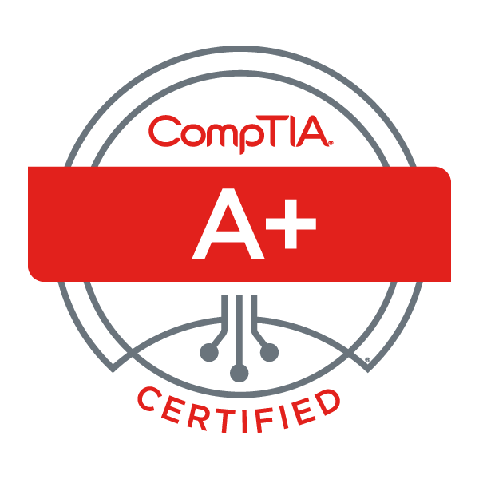
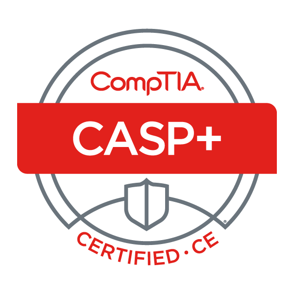
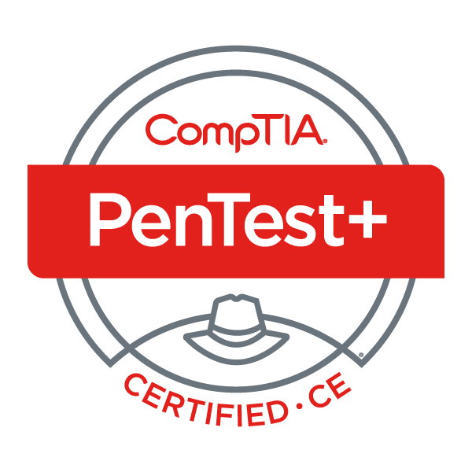
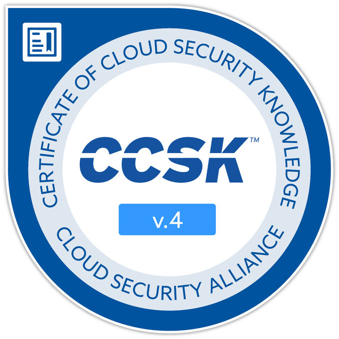
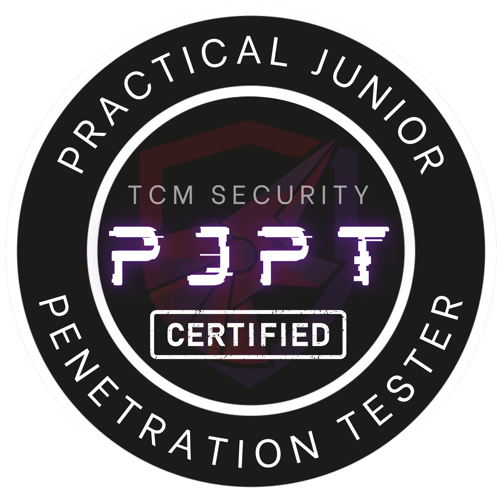

# Hey, I'm Nishi 👋

**Cybersecurity Engineer** | Offensive Security | DevOps | Systems Programming | AI Security Research

---

## Certifications

	
	
	
	
	
	
	

---

## 🔬 Projects

<table>
<tr>
<td width="50%">

### 🍄 [Mycelium](https://github.com/ItsNishi/Mycelium)
Kernel-level OS access for AI agents via MCP. 50 tools across process, memory, network, security, and eBPF tracing -- with a policy engine for safe agent deployment. Cross-platform (Linux + Windows).

`Rust` `MCP` `eBPF` `Systems Programming`

</td>
<td width="50%">

### 🛡️ [AI-Agent-Security](https://github.com/ItsNishi/AI-Agent-Security)
Security research on AI coding agent attack surfaces. 18 research notes covering prompt injection, skill poisoning, MCP exploitation, and defense patterns. Includes scanning skills for vetting agent configs.

`Python` `AI Security` `Research` `Defensive`

</td>
</tr>
<tr>
<td width="50%">

### 🦎 [GeckoGlue](https://github.com/ItsNishi/GeckoGlue)
Compatibility fix scripts for stubborn apps on openSUSE Tumbleweed. Automated dependency resolution for Unity3D, DaVinci Resolve, Epson drivers, and more.

`Shell` `openSUSE` `Linux` `Automation`

</td>
<td width="50%">

### 📝 [PJPT](https://github.com/ItsNishi/PJPT) ⭐ 8
Study notes for TCM Security's Practical Junior Penetration Tester certification. Covers networking, Linux, Active Directory, web app attacks, and OSINT.

`Pentesting` `Notes` `TCM Security` `PNPT`

</td>
</tr>
</table>

---

## Tech Stack

### 🎯 Security & Offensive

### ⚙️ Infrastructure

### 💻 Languages

---

## Connect

